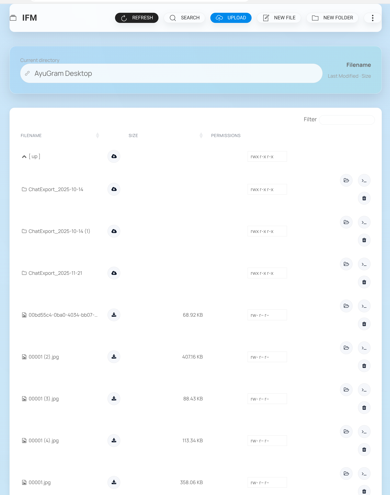

# IFM – Improved File Manager

Web-based, single-file file manager built with PHP. Modern UI (now powered by UIkit) brings quick access to common filesystem tasks: browse, search, edit, upload, archive, and more.

## Contents
- [Highlights](#highlights)
- [Tech Stack](#tech-stack)
- [Requirements](#requirements)
- [Installation](#installation)
- [Configuration](#configuration)
- [Keybindings](#keybindings)
- [Docker](#docker)
- [Screenshots](#screenshots)
- [Issues](#issues)

## Highlights
- Create, edit, copy/move, rename, and delete files/directories.
- Upload locally, drag & drop, or remote URL upload; overwrite confirmation supported.
- Download files or whole directories; create/extract archives (tar/tgz/tar.gz/tar.bz2/zip).
- Permission editing, image previews, and responsive table with quick actions.
- Inline ACE editor with syntax selection, word-wrap, invisible chars toggle, and fullscreen.
- Simple authentication (LDAP via `ldap_bind` supported).

## Tech Stack
- PHP backend (single entrypoint).
- UIkit 3 for layout/components, custom icon set via Fontello.
- ACE Editor, jQuery, Mustache, BootstrapMenu, DataTables.

## Requirements
- Client: modern browser with JS enabled.
- Server: PHP ≥ 7.4 with extensions: bz2, curl (remote upload), fileinfo, json, ldap (if used), mbstring, openssl (https uploads), phar, posix, zip, zlib.

## Installation
1) Download the latest release: https://github.com/misterunknown/ifm/releases/latest  
2) Choose either:
   - **CDN build** – loads core libraries from CDNs (smallest payload).
   - **Bundled build** – ships all dependencies locally.
3) Deploy `ifm.php` to your server. Minified `*.min.php` files are gzip-compressed; prefer the standard build unless size is critical.

## Configuration
- All options are documented in the wiki: https://github.com/misterunknown/ifm/wiki/Configuration  
- Environment variables (`IFM_*`) mirror the config keys (e.g., `IFM_ROOT_DIR`, `IFM_AUTH`, `IFM_AUTH_SOURCE`).  
- Authentication details: https://github.com/misterunknown/ifm/wiki/Authentication  
- By default, `.htaccess` is hidden/edit-protected because configuration can come from env vars.

## Keybindings
- `e` edit/extract · `g` focus path · `r` refresh · `/` search · `u` upload · `o` remote upload  
- `F` new file · `D` new directory · `c m` copy/move · `n` rename · `Del` delete · `Space` select  
- `h j k l` or arrows to navigate · `Enter` open/change dir · `Ctrl`+`Shift`+`f` toggle editor fullscreen

## Docker
Base: `php:8-cli-alpine`, exposes port 80, entrypoint `/usr/local/bin/docker-startup.sh`.

### Build
```bash
docker build -t ifm .
```

### Run
```bash
docker run --rm -d --name ifm \
  -p 8080:80 \
  -v /path/to/data:/var/www \
  ifm:latest
```

### UID/GID
Run as a specific user/group:
```bash
docker run ... -e IFM_DOCKER_UID=1000 -e IFM_DOCKER_GID=100 ifm:latest
```

### Other notes
- Default root directory inside the container: `/var/www` (symlinked to `/usr/local/share/webapps/ifm/www`).  
- Configurable via env vars, e.g.:
```bash
docker run --rm -p 8080:80 -v /var/www:/var/www \
  -e IFM_AUTH=1 \
  -e IFM_AUTH_SOURCE="inline;admin:<hash>" \
  ifm
```

## Screenshots



## Issues
Found a bug or missing feature? Open an issue on GitHub.  
